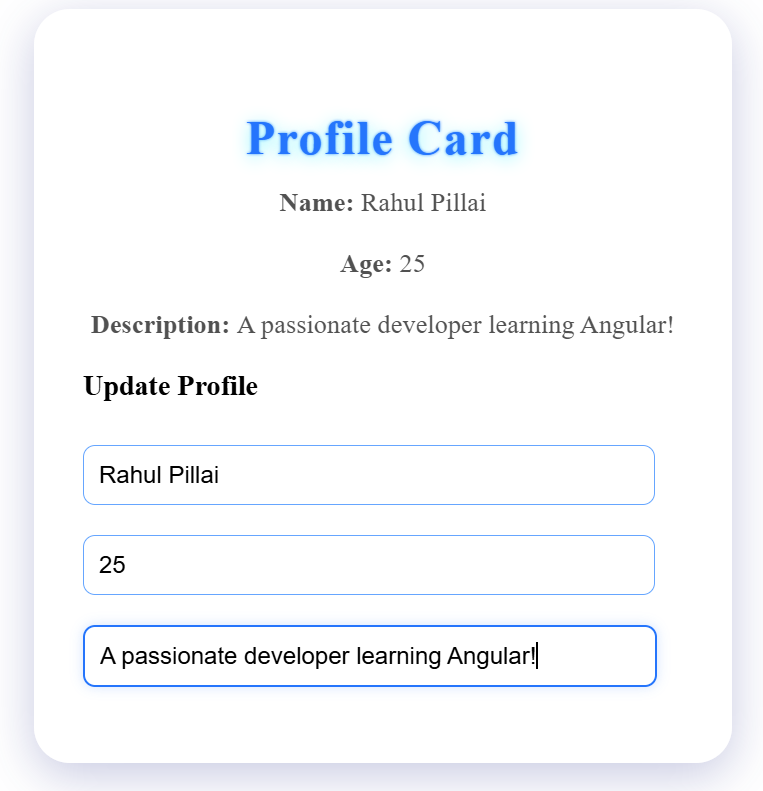
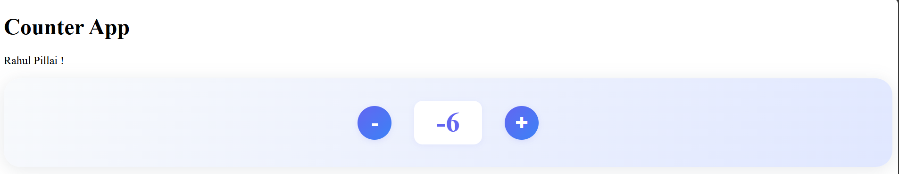
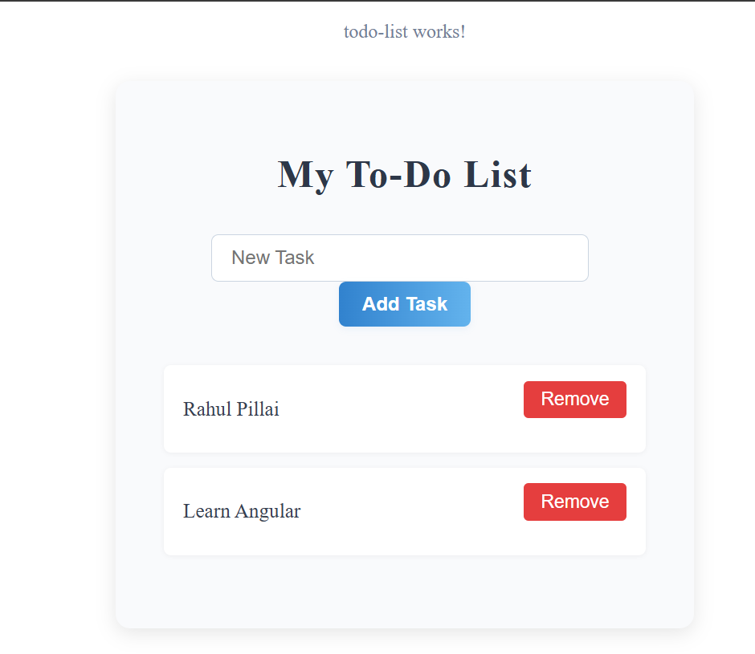
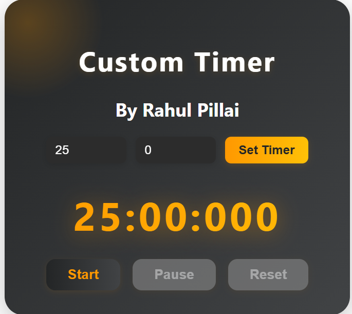
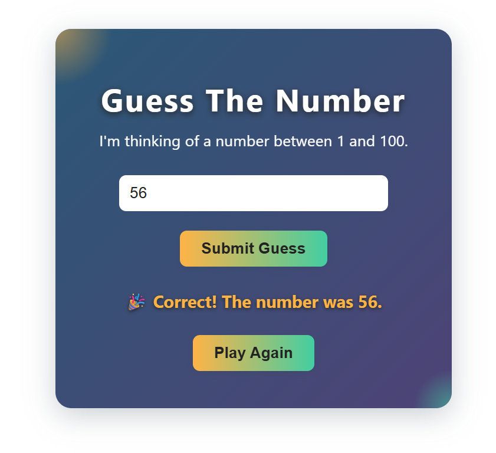
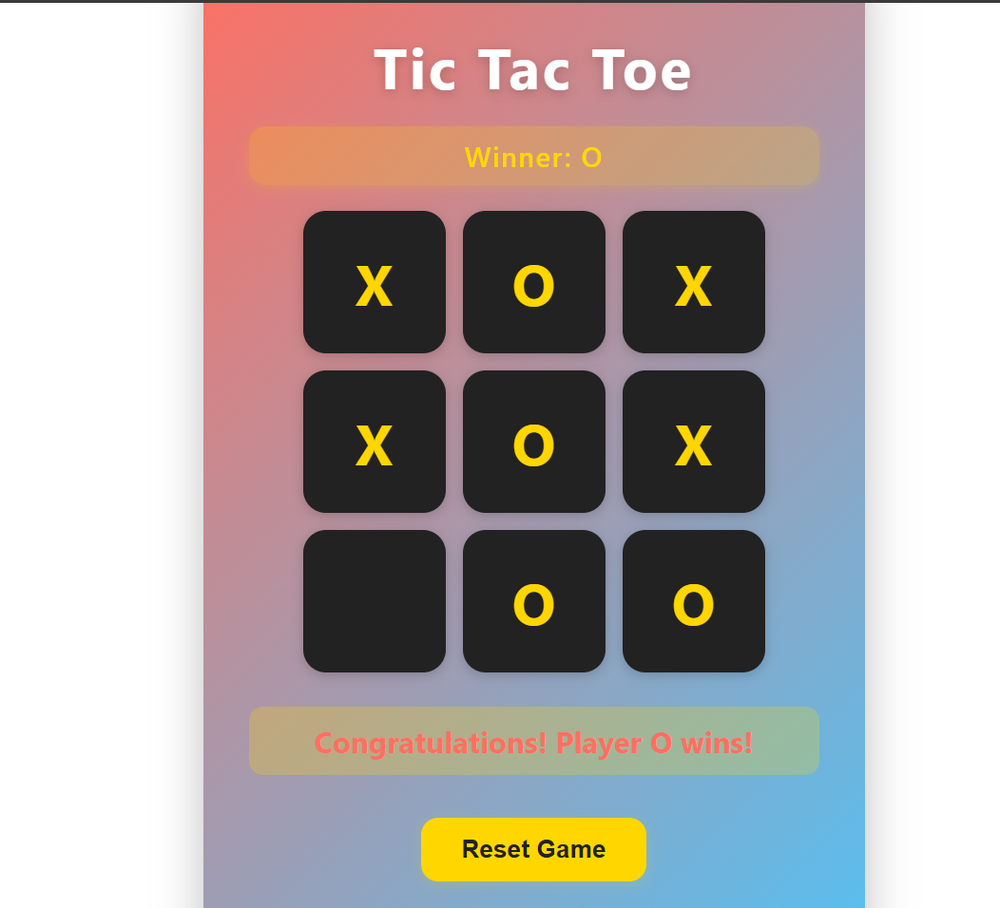
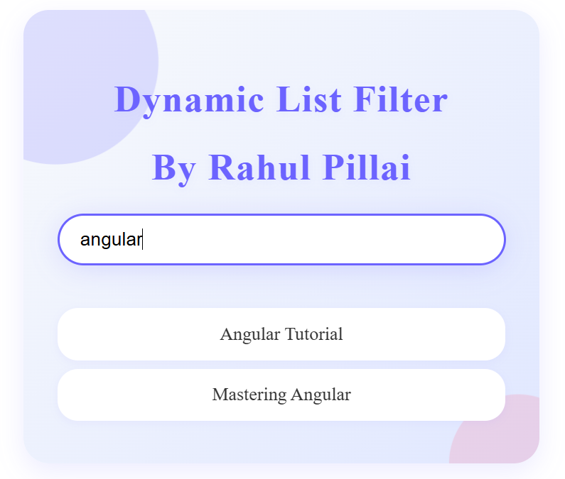

# My Angular Project

## Extensions
* prettier code - settings -> formatter -> set prettier code.
* save -> onfocuschange
* auto complete tag
* Auto rename tag
* Color highlight
* path intellisense 
* css navigation
* css peak
* HTML CSS Support
* stylelint 
* Auto import ES6,TS,JSX,TSX
* JavaScript (ES6) code snippets
* material icon theme
* Better comments
* image preview
* indent rainbow
* json
* rainbow csv
* live preview
* live server
* project manager
* code runner
* vscode pdf
* git history
* git graph

## Install Nodejs and Angular 

* Directly install from google search
* Angular -> open cmd-> npm install -g @angular/cli@20
* To create new project in terminal -> ng new Projectname

# Angular Projects:

1. Profile Card - 
    * Concepts : string interpolation - {{ name }} - used to display data to app/application.html.
    <!-- implement two way data binding next  import FormsModule in app.module.ts , use ngModel in input fields-->

    * Play :https://github.com/CoderRahu1/Angular/blob/main/1.profile-card/src/index.html

2. Counter - 
    * Concepts : Event binding to method, adding ng new component counter to app

3. TODO List - 

    * Concepts : selector from todolist component.ts should be in appcomponent.html Appcomponent.ts should contain import[todolistcomponent]

4. Stopwatch
    * Concepts - pipe operator

5. Guess the Number(Game) 
    * Concepts - mutiple methods

6. Tic Tac Toe Game:
    * Concepts - a. Define winning patterns, b. reset game, c. draw game

7. Dynamic List Filter/:
    * Concepts - a. Data Binding, b. Pipe Operator - ng generate pipe filter>name.

